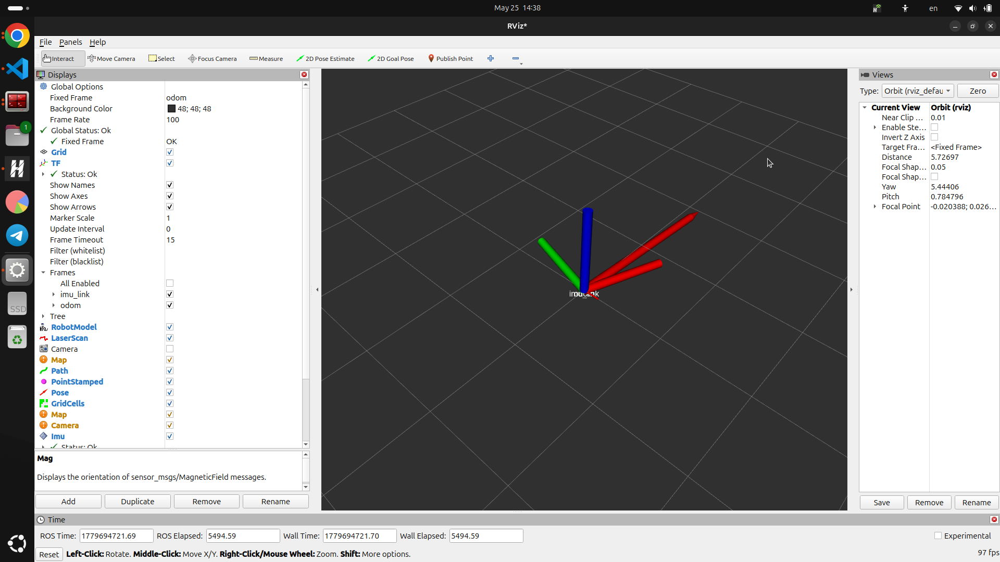
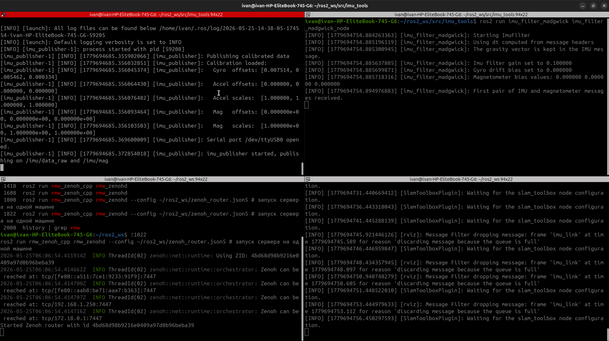

# imu_tools_ros2




---

Пакет для ros2 jazzy, позволяющий удобно откалибровать IMU.

## Требования:
 - IMU Должен быть подключен через `UART`, неважно, что за устройство будет передавать информацию: Arduino, STM, ESP, FT.
 - Данные должны поступать в таком формате: `"ax,ay,az,gx,gy,gz,mx,my,mz"`.
 - Настройка параметров в `.yaml` файлах.
 - Установленный `C++20` компилятор.

## Сборка:
```bash
cd ros2_ws/src/
git clone https://github.com/IvanS297/imu_tools_ros2.git
colcon build --symlink-install --packages-select imu_tools # опция symlink install нужна для того, чтобы не пересобирать постоянно пакет, если в yaml файле что-то поменялось 
```

## Запуск:
### Калибровщик IMU:
```bash
source install/setup.bash
ros2 run imu_tools imu_calibrator
```
Следуйте инструкциям для калибровки

Он сохраняет данные в файлы `.txt`, нужно открыть эти файлы и перенести значения в `imu_config.yaml`

### Паблишер:
```bash
source install/setup.bash
ros2 launch imu_tools imu.launch.py
```

```bash
ivan@ivan-HP-EliteBook-745-G6:~$ ros2 topic list
/imu/data
/imu/data_raw
/imu/mag
/parameter_events
/rosout
/tf
/tf_static
```

## Другие гайды на калибровку IMU:
 - https://github.com/IvanS297/IMU_calibration_guide
 - https://github.com/IvanS297/IMU_Calibration_2
